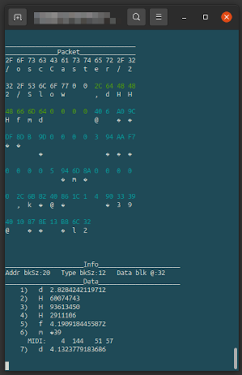

# oLvosc
**oLvosc** is an OSC ( *Open Sound Control* ) module for Lua and LÖVE. It's in two parts:

  * oLvosc
     * The main OSC module, which works in Lua (V5.3 or greater) or LÖVE (tested on 11.3)
  * oLvoscT
     * The threaded server module, for LÖVE (tested on 11.3) only

Both modules require the Lua 'socket' library.

## About *OSC* 

*Open Sound Control* is a networking protocol designed to enable communication between multimedia devices, musical instruments, synthesizers, effects and recording equipment (DAWs). It was intended to suppliment (maybe supplant?) MIDI hardware and protocol, and is *generally* much quicker.

OSC is a wireless protocol, and uses UDP packets over ethernet networks, but can work via USB and also between software applications on a host computer.

Because it utilizes UDP, OSC is not hardened for critical operations. UDP messages are send, but delivery is not guaranteed. Still, for musical performance data it works well.

## About *oLvosc* 



The **oLvosc** module is a 'pure Lua' library for encoding, decoding, sending and receiving OSC messages. It's reasonably fast (but not as quick as a compiled library).

The server routine is non-blocking, a less-reliable approach in a complex Lua script.

**oLvosc** currently only supports a sub-set of OSC messages. *Blobs* are not supported (yet).

## About *oLvoscT* 

The **oLvoscT** module is a LÖVE-only OSC *threaded* server. It runs concurrently with the main LÖVE script, and pushes incoming OSC packets into a queue. 

As a separate thread it is more reliable than the standard non-blocking OSC server in *oLvosc*.

## Demos, LÖVE & Lua

The console-only documentation for the [Lua demos is here](https://github.com/GModal/oLvosc/blob/main/oLvosc_Lua_demo/README.md).

A brief synopsis of the LÖVE [demos is available on the oLvgui repo](https://github.com/GModal/oLvgui/blob/main/oLvDemos.md) (not all demo feature OSC) and the [demo source code](https://github.com/GModal/oLvgui/tree/main/demo_src) also.

## oLvosc Network Functions

`client_socket = oLvosc.cliSetup(address_string, port#)`

  * Creates a new client (sending) socket

`nil = oLvosc.sendOSC(client_socket, packet)`

  * Send an OSC packet to the client socket

`server_socket = oLvosc.servSetup(address_string, port#)`

  * Creates a new non-blocking server (receiving) socket

`packet = oLvosc.oscPoll(server_socket)`

  * Poll the non-blocking server
    * Do this often, or incoming data is lost

`nil = oLvosc.close(any_socket_type)`

  * Closes any open socket


## oLvosc Data Functions

`packet = oLvosc.oscPacket (address_str, type_str, msg_table)`

  * Encodes an address string, a type string and a table of messages into a UDP packet
    * packet is ready for sending ( oLvosc.sendOSC(server, packet) )

`address_str, type_str, data = oLvosc.oscUnpack(packet)`

  * Decodes a received UDP packet into:
    * an address string
    * a type string
    * a data sub-packet

`table = oLvosc.oscDataUnpack(type_str, data)`

  * Decodes a data sub-packet into a table of usable data
    * the type string is the 'key' to the packed data
    * skip this step if the incoming type_str is nil -- in that case, there is no data

`string = oLvosc.oscAddrCmd(address_str)`

  * Returns the last portion of the address string (after the last forward slash)
  * many applications send ONLY the address string -- the string is the data

`string_table = oLvosc.oscAddrSplit(address_str)`

  * Splits the address string into it's atoms ('/' is the separator)

`midi_packet = oLvosc.packMIDI(mChannel, mStatus, mByte1, mByte2)`

  * Encodes the four bytes of an OSC 'MIDI' message into a sub-packet

`mChannel, mStatus, mByte1, mByte2 = oLvosc.unpackMIDI(midi_packet)`

  * Decodes a MIDI sub-packet into the four original bytes

## oLvosc Examples

### Open a client socket (sending)

```
-- early in the script
local cudp

	-- setup OSC send (client)

  -- sample options: '127.0.0.1', 'localhost', or the local machine addr
  -- and the multicast addr, something like: '224.0.0.1'

	cudp = oLvosc.cliSetup('224.0.0.1', 3819)
```

### Sending a packet

Usually from within a callback...

```
-- Define a packet somewhere
local packet

        -- send Ardour a msg that's just the address

    packet = oLvosc.oscPacket('/goto_start')
	oLvosc.sendOSC(cudp, packet) 

        -- send Ardour a message, with a type and a message table

    packet = oLvosc.oscPacket('/access_action', 's', {'Editor/track-record-enable-toggle'})
    oLvosc.sendOSC(cudp, packet)

        -- something more complicated, a message for pd2jack
        -- this is an osc msg with **string, int, int** fields, per the type string

    local mymsg = {"@sendprogc", chordChan, index}

    local packet = oLvosc.oscPacket('/P2Jcli/0/cmd', 'sii', mymsg)
    oLvosc.sendOSC(cudp, packet)
```

### Open a server socket (receiving, non-blocking)

```
-- early in the script
local sudp
	-- setup OSC receive (server)

  -- sample options: '127.0.0.1', 'localhost','*', '0.0.0.0', or the local machine addr
  -- and the multicast addr, something like: '224.0.0.1'
  -- '0.0.0.0' works well for mobile devices (server only), listens to all the senders on network

	sudp = oLvosc.servSetup('0.0.0.0', 8000)
```

### The server function

```
-- poll the OSC server 
function myServ(server_socket)
  local packet = oLvosc.oscPoll(server_socket)
	if packet ~= nil then
    --oLvosc.oscDumpBin(packet)

        local oscADDR, oscTYPE, oscDATA = oLvosc.oscUnpack(packet)
        local dataT = oLvosc.oscDataUnpack(oscTYPE, oscDATA)

        -- Do Something
        -- output to console
        print(oscADDR, oscTYPE)
        if dataT ~= nil then
          for i, v in ipairs(dataT) do
            print(i..')', v)
          end
        end

    end
end
```

### Call the server from love.update() or love.draw()

```
function love.draw()
   myServ(sudp)    -- poll server
   oLvgui.drawoLv(gui)
end
```

### Close the socket

Close works with client & server sockets.

```
oLvosc.close(any_socket)
```

# The Threaded Server
## oLvoscT Network Functions

### Note: These are for the LÖVE-only threaded server.

`thread = oLvoscT.servSetup(address_str, port#, thread_name (, timeout))`

  * Creates a new threaded server, standard IP address string, and port number
    * the thread name is a unique name used to create a *channel* for receiving data
    * timeout is optional, default is 1.5 seconds. Longer timeouts will take longer to return on closing

`terminate_channel = oLvoscT.getTermChan(thread_name)`

  * Returns the 'termination channel', which is used to send the thread a msg to terminate
    * The term channel name is built from the the original 'thread name' so that must be passed to the function

`nil = oLvoscT.closeServ(terminate_channel)`

  * Call this function with the 'termination channel' and the thread will end

`nil = oLvoscT.error(threadT)`

  * Include this and the thread will terminate on an exception (but thread will be killed)

## Example Threaded Server for LÖVE

### Create the server

```
  -- somewhere near the top
  local chanName, threadT, chanT

  -- setup OSC server, (blocking) LÖVE ONLY, not pure Lua
  --    NOTE: the module name is 'oLvoscT' not 'oLvosc' -- T for threads
  -- MUCH more reliable than non-blocking, but requires threads
  -- same address & port options + channel name
  -- standard 'oLvosc' packet/data functions work with data
  -- needs channels to pass data to main thread

  chanName = 'sOSC'     -- a channel for data, give it a name

      -- init the server
  threadT = oLvoscT.servSetup('0.0.0.0', 8000, chanName)

  -- if no thread, no channel
  if threadT ~= nil then
      -- get the actual channel created for our name
    chanT = love.thread.getChannel( chanName )
  end
```

### Define a server function to access incoming data, in the main thread

Call that server function from love.update() or love.draw().

```
function love.draw()
   myServ(chanT)    -- check server queue
   oLvgui.drawoLv(gui)
end
```

### The server function reads the queue

  * The blocking server thread pushes UDP packets on to the channel.
  * The server function (in the main script) checks the channel for packets ( **chanT:getCount()** )
  * If the channel queue is NOT empty, pop a packet off the queue ( **chanT:pop()** )
    * Do something with the packet (regular **oLvosc** data function work fine here)

```
function myServ(chanT)

  while chanT:getCount() ~= 0 do
      local packet = chanT:pop()   -- packet data passed through a channel queue
      if packet ~= nil then
        local oscADDR, oscTYPE, oscDATA = oLvosc.oscUnpack(packet)
        local dataT = oLvosc.oscDataUnpack(oscTYPE, oscDATA)

    -- Do something with the data
      end
    end
end
```

## Kill the server thread

It's important to define an oLvquit() function especially for threads. This function isn't usually so complicated for a non-thread shutdown, but here's the threaded version:

  * Get the 'termination channel' -- call oLvoscT.getTermChan() with the original name (string)
  * Send that channel to oLvoscT.closeServ(), it will signal the thread to close
  * Be sure to wait for the thread to terminate
  * Call the normal LÖVE quit() function

```
-- define an oLvquit() function
-- it's REALLY important if a thread is running...and user closes LOVE with the Android 'back' button

function oLvquit()
  local tchn = oLvoscT.getTermChan(chanName)    -- get the channel to terminate the thread
  oLvoscT.closeServ(tchn)                       -- send a close msg over that channel

                     -- wait for server thread to close...(hint, the wait is the timeout value)
                           -- unless there's incoming OSC data, then it's faster...
  threadT:wait( )
                     -- exit LÖVE normally
  love.event.quit()
end
```

### If the server thread isn't closed gracefully, LÖVE may not restart on your device.

Until it's rebooted...