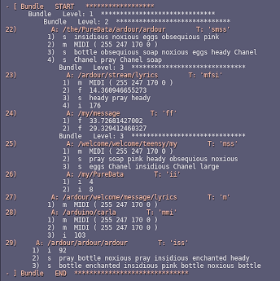

# oLvosc
**oLvosc** is an OSC ( *Open Sound Control* ) module for Lua and LÖVE. It's in two parts:

  * oLvosc
     * The main OSC module, which works in Lua (V5.3 or greater) or LÖVE (tested on 11.3, some testing on 11.4)
  * oLvoscT
     * The threaded server module, for LÖVE (tested on 11.3) only

Both modules require the Lua 'socket' library.

## About *OSC* 

*Open Sound Control* is a networking protocol designed to enable communication between multimedia devices, musical instruments, synthesizers, effects and recording equipment (DAWs). It was intended to suppliment (maybe supplant?) MIDI hardware and protocol, and is *generally* much quicker.

OSC is a wireless protocol, and uses UDP packets over ethernet networks, but can work via USB and also between software applications on a host computer.

Because it utilizes UDP, OSC is not hardened for critical operations. UDP messages are send, but delivery is not guaranteed. Still, for musical performance data it works well.

## About *oLvosc* 


The **oLvosc** module is a 'pure Lua' library for encoding, decoding, sending and receiving OSC messages. It's reasonably fast (but not as quick as a compiled library).

The server routine is non-blocking, a less-reliable approach in a complex Lua script.

**oLvosc** supports a large sub-set of OSC protocols. As of 0.2.4, *Bundles* **are** supported.

**The following types are currently supported:**

  - s : string
  - S : synonym for 's' (or symbol)
  - c : a char (32 bit int)
  - i : int (32-bit)
  - r : rgb (another 32-bit int)
  - m : MIDI data, four bytes: channel, status, d1, d2
  - t : TIME tag, two 32 ints: seconds, fraction of seconds
  - f : float (32-bit)
  - b : BLOB data, binary bytes
  - h : signed int (64-bit)
  - d : double float (64-bit)

The following have NO data block (but are DEcoded to a string: 'NIL', 'TRUE', etc...

  - N : NIL
  - T : TRUE
  - F : FALSE
  - I : IMPULSE (was INFINITUM)
  - [ : Array begin
  - ] : Array end

Some of these (notably the array brackets) are experimental, as there's no universally-accepted interpretation for their usage. The 'c' tag (char) is also subject to interpretation. Here it is implemented as a utf8 unicode char. Other libraries limit the char to ASCII.

## About *oLvoscT* 

The **oLvoscT** module is a LÖVE-only OSC *threaded* server. It runs concurrently with the main LÖVE script, and pushes incoming OSC packets into a queue. 

As a separate thread it is more reliable than the standard non-blocking OSC server in *oLvosc*.

## Demos, LÖVE & Lua

The docs for the console-only [Lua demos is here](https://github.com/GModal/oLvosc/blob/main/oLvosc_Lua_demo/README.md).

A brief synopsis of the LÖVE [demos is available on the oLvgui repo](https://github.com/GModal/oLvgui/blob/main/oLvDemos.md) (not all demo feature OSC) and the [demo source code](https://github.com/GModal/oLvgui/tree/main/demo_src) also.


## oLvosc Network Functions

`client_socket = oLvosc.cliSetup(address_string, port#)`

  * Creates a new client (sending) socket

`nil = oLvosc.sendOSC(client_socket, packet)`

  * Send an OSC packet to the client socket

`server_socket = oLvosc.servSetup(address_string, port#)`

  * Creates a new non-blocking server (receiving) socket

`packet = oLvosc.oscPoll(server_socket)`

  * Poll the non-blocking server
    * Do this often, or incoming data is lost

`nil = oLvosc.close(any_socket_type)`

  * Closes any open socket


## oLvosc Data Functions

`packet = oLvosc.oscPacket(address_str, type_str, data_table)`

  * Encodes an address string, a type string and a table of data into a UDP packet
    * packet is ready for sending ( oLvosc.sendOSC(server, packet) )

`address_str, type_str, data = oLvosc.oscUnpack(packet)`

  * Decodes a received UDP packet into:
    * an address string
    * a type string
    * a data sub-packet

`table = oLvosc.oscDataUnpack(type_str, data)`

  * Decodes a data sub-packet into a table of usable data
    * the type string is the 'key' to the packed data
    * skip this step if the incoming type_str is nil -- in that case, there is no data

`string = oLvosc.oscAddrCmd(address_str)`

  * Returns the last portion of the address string (after the last forward slash)
  * many applications send ONLY the address string -- the string is the data

`string_table = oLvosc.oscAddrSplit(address_str)`

  * Splits the address string into it's atoms ('/' is the separator)

`midi_packet = oLvosc.packMIDI(mChannel, mStatus, mByte1, mByte2)`

  * Encodes the four bytes of an OSC 'MIDI' message into a sub-packet

`mChannel, mStatus, mByte1, mByte2 = oLvosc.unpackMIDI(midi_packet)`

  * Decodes a MIDI sub-packet into the four original bytes

`blob_size, blob_data = oLvosc.unpackBLOB(blob)`

  * Decodes a blob to an integer (size of data), and a data block


  - ### Time functions

`time_secs, time_fraction, fraction_as_float, epoch_time = oLvosc.time()`

  * Returns the current time (OSC, which is NPT time) as:
    * Time in seconds since Jan 1, 1900 (32 bit integer)
    * Additional fraction of second (32 bit integer)
    * That fraction as a float
    * The current time as Unix 'Epoch' time

`Epoch_time = oLvosc.NTPtoEPOCH(sec, frac)`

  * `<sec><frac>`: the seconds, fractions of a second of NTP time
  * Returns that time in Epoch time

`time_secs, time_fraction, float fraction = function oLvosc.EPOCHtoNTP(epoch)`

  * `<epoch>` : time in Epoch format
  * Returns NTP time : `<time_secs>, <time_fraction>` and the fraction as a float

`time_packet = oLvosc.packTIME(time_seconds, time_fraction)`

  * Encodes time in seconds, fractions of seconds (both integers)
    * 'OSC timetag' is the same as NTP time: time since Jan 1, 1900
  * Returns a packed 8-byte data blk of OSC (NTP) format time

`time_secs, time_fraction = oLvosc.unpackTIME(tPack)`

  * Takes a timetag binary packet
  * Returns time in seconds, fractions of seconds

  - ### Time Constants:

`timetag = oLvosc.TT_IMMEDIATE`**

  * This constant creates an OSC "immediate time tag", a part of the OSC 1.0 bundle spec.
  * It's interpreted as **NOW**.


## oLvosc Bundle Support

As of version 0.2.4., **oLvosc** now supports bundles! Bundles can be nested per the OSC 1.0 spec. The current code does this recursively -- see **oLvosc.addBundleToBundle()**. This works for both decoding and creating bundles.

Thanks to Github user [halee88](https://github.com/halee88) for contributing the initial bundle unpacking function.

## Bundle Packet Decoding 

  - ### Functions:

The **oLvosc.oscUnpackBundle()** function returns a bundle "tree" structure. This table includes all the embedded message and timetag data, and also a "level" value, which indicates how deeply "nested" the bundle is within the tree.

`timetag = oLvosc.isBundle(packet)`

  * Returns an oLvosc timetag if the packet is a bundle, nil if not.

`bundle_tree = oLvosc.oscUnpackBundle(packet [, level])`

  * Returns a bundle in a "tree" structured table.
  * `<level>` sets the starting level of the tree. It's optional when called, as it's *real* use is to recursively find the current depth of the nested data.

`bundle_list = oLvosc.bundleResultsToList(bundle_tree [, filter])`

  * Returns a "flattened" version of the results of **oLvosc.oscUnpackBundle()**. I.E., it converts the tree structure to a flat list.
  * The "level" information is still retained in the list.
  * `<filter>` set the type of information returned in the list:
    * `<'b'>` : returns only bundle info
    * `<'m'>` : returns only messages

## Bundle Creation

The bundle packet creation routines are described below. This code has **some** error checking, but it's a still a light-weight implementation... DON'T create circular references (like adding a bundle to itself).

Before generating a bundle packet, use these function to build a bundle "data table," which is a simple tree structure table. This table is NOT identical to the tree structure returned by **oLvosc.oscUnpackBundle()**.

  - ### Constants:

`timetag = oLvosc.TT_IMMEDIATE`

  * This constant creates an OSC "immediate time tag", a part of the OSC 1.0 bundle spec.
  * It's interpreted as **NOW**.

  - ### Functions:

`bundle_dt = oLvosc.oLvosc.newBundle(oscTimetag)`

  * Creates a new, empty bundle_dt (data table), and sets the timetag.

A bundle_dt is a data table which holds the bundle
structure & data, pre-build. A bundle osc packet is built
from this preliminary information & framework.

`bool = oLvosc.addMsgToBundle(bundle_dt, msg_packet)`

  * Add an osc Msg packet to a bundle_dt
  * if rval == false, the bundle is locked (or the bundle is invalid).

`nil = oLvosc.addBundleToBundle(parentBundle, childBundle)`

  * No additional data can be added to the child (sub-bundle) after this operation.
  * Once added, the child bundle is locked, and addMsgToBundle() won't function on the child.

Therefore, sub-bundles should be fully populated before adding to a parent bundle. However, additional elements (msgs & bundles) can be added to the parent bundle.

`bundle_packet = oLvosc.oscBundlePack(bundle_dt)`

  * Generate a transmissible bundle packet from a populated bundle_dt.

  - ### Sending bundles

Bundles packets are sent like any other OSC packet -- with **oLvosc.sendOSC()**

### Example of a bundle structure (formatted)

Below is a screen capture of a bundle-formatted display in **oscMonD** (in LÖVE), illustrating the tree structure of *this* bundle.

This is very similar to the output of other formatting helpers in the utility scripts. The *oscdump.lua* script creates a very similar display in a shell. 



(The osc bundle was generated randomly with the *sendrandpacket.lua* script.)

### Bundle Support routines:

While not built into the oLvosc library module, there are useful utility routines in the demo folder. They include functions to:

  * View a bundle "tree" structure
  * Search a bundle structure
  * View the bundle data table, pre-packet
  * Screen-formatting functions (displaying msgs)


## New with 0.1.2

The types below are part of the OSC 1.0 specifications, but are "optional." The only required types in 1.0 are ‘i f s b’ (int, float, string, blob).

###Required types in V1.1 supported in oLvosc

  - i : Integer: two’s complement int32
  - f : Float: IEEE float32
  - s : NULL-terminated ASCII string
  - b : Blob, (aka byte array) with size
  - T : True: No bytes are allocated in the argument data.
  - F : False: No bytes are allocated in the argument data.
  - N : Null: (aka nil, None, etc). No bytes are allocated in the argument data.
  - I : Impulse: (aka “bang”), used for event triggers. No bytes are allocated in the argument data. This type was named “Infinitum” in OSC 1.0 optional types.
  - t : Timetag: an OSC timetag in NTP format, encoded inthe data section


### Tags: 'I', 'T', 'F', 'N', '[', ']' Added

These are non-data bearing typetags, so be sure to read the section on building packets with that type. 

### Data tag 'c' tag added: single character

The 'c' tag sends a single character, sent in a 32-bit chunk. In this implimentation it's a utf8 unicode char. That also means that simple ASCII chars also work fine.

Passing a char is as simple as using quotes & Lua strings:  Examples: '✔' or '‡'

### Data typetag 't' added: OSC Timetag

  * Encoding and decoding, sending and receiving of timetags 't' added to data functions.

The 't' tag is an OSC-compliant time tag & data block.

  * 't' tag
  * 8-byte data block, consisting of
    * 32 int of seconds (since Jan 1 1900)
    * 32-bit in of additional fractions of seconds

### Data typetags 'r', 'd', 'h' added: 

  - 'r' : rgb
  - 'd' : double float
  - 'h' : double int


## oLvosc Examples

### Open a client socket (sending)

```
-- early in the script
local cudp

	-- setup OSC send (client)

  -- sample options: '127.0.0.1', 'localhost', or the local machine addr
  -- and the multicast addr, something like: '224.0.0.1'

	cudp = oLvosc.cliSetup('224.0.0.1', 3819)
```

### Sending a packet

Usually from within a callback...

```
-- Define a packet somewhere
local packet

        -- send Ardour a msg that's just the address

    packet = oLvosc.oscPacket('/goto_start')
	oLvosc.sendOSC(cudp, packet) 

        -- send Ardour a message, with a string type and a data table with one entry:

    packet = oLvosc.oscPacket('/access_action', 's', {'Editor/track-record-enable-toggle'})
    oLvosc.sendOSC(cudp, packet)

        -- something more complicated, a message for pd2jack
        -- this is an osc msg with 'string, int, int' fields, per the type string 'ssi'

    local mymsg = {"@sendprogc", chordChan, index}

    local packet = oLvosc.oscPacket('/P2Jcli/0/cmd', 'sii', mymsg)
    oLvosc.sendOSC(cudp, packet)
```
### Preparing packets with non-data bearing tags

All tags without accompanying data ('I T F N [ ]') are required to include a 'placeholder' in the data table before passing to oLvosc.oscPacket().

```
    -- Sending a string, an integer, and a 'TRUE' tag
    --   Type str:   'siT'

    -- in this example the placeholder is an empty string
    local mymsg = {"@sendprogc", index, ''}

    -- anything (but nil) will work as a placeholder, so all the following are valid:
    mymsg = {"@sendprogc", index, '-'}
    mymsg = {"@sendprogc", index, 'T'}
    mymsg = {"@sendprogc", index, 'TRUE'}
    mymsg = {"@sendprogc", index, 'blablabla'}

    local packet = oLvosc.oscPacket('/P2Jcli/0/cmd', 'siT', mymsg)
    oLvosc.sendOSC(cudp, packet)
```

Lua has very limited typecasting, so it would be difficult to differentiate between ints, floats, etc. Entries in both the TYPE string and the DATA table are required. 

From a code *readability* standpoint it's also very helpful to have a one-to-one correspondence between TYPE and DATA fields.


### Creating and sending a nested bundle packet

```
    --create empty bundle dt's (bundle data tables)
    local parent = oLvosc.newBundle(oLvosc.packTIME(2, 32555))
    local child = oLvosc.newBundle(oLvosc.TT_IMMEDIATE)

    -- populate the child bundle
    local packetC1 = oLvosc.oscPacket('/myOSC/child', 'ff', { 23.3333 , 65.5} )
    oLvosc.addMsgToBundle(child, packetC1)

    -- populate the parent bundle
    local packetP1 = oLvosc.oscPacket('/myOSC/parent', 'is', { 44434 , 'A msg'} )
    local packetP2 = oLvosc.oscPacket('/myOSC/parent', 'ifs', { 1 , 34.255, 'Sending CC Mod'} )
    oLvosc.addMsgToBundle(parent, packetP1)
    oLvosc.addMsgToBundle(parent, packetP2)

    -- add the child bundle to the parent bundle
    oLvosc.addBundleToBundle(parent, child)

    -- build the bundle packet
    local bundlePacket = oLvosc.oscBundlePack(parent)

    -- send it
    oLvosc.sendOSC(cli, bundlePacket)
```


### Open a server socket (receiving, non-blocking)

```
-- early in the script
local sudp
	-- setup OSC receive (server)

  -- sample options: '127.0.0.1', 'localhost','*', '0.0.0.0', or the local machine addr
  -- and the multicast addr, something like: '224.0.0.1'
  -- '0.0.0.0' works well for mobile devices (server only), listens to all the senders on network

	sudp = oLvosc.servSetup('0.0.0.0', 8000)
```

### A server function

```
-- poll the OSC server 
function myServ(server_socket)
  local packet = oLvosc.oscPoll(server_socket)
	if packet ~= nil then

        local oscADDR, oscTYPE, oscDATA = oLvosc.oscUnpack(packet)
        local dataT = oLvosc.oscDataUnpack(oscTYPE, oscDATA)

        -- Do Something
        -- output to console
        print(oscADDR, oscTYPE)
        if dataT ~= nil then
          for i, v in ipairs(dataT) do
            print(i..')', v)
          end
        end

    end
end
```

### A server function with bundle support

  - This function only receives and prints bundles -- and a short synopsis of the messages within.

```

-- make unpack work with lua 5.3+ or LÖVE
local unpack = unpack or table.unpack

-- poll the OSC server 
function myServ(server_socket)
    local packet = oLvosc.oscPoll(server_socket)
	if packet ~= nil then

        if oLvosc.isBundle(packet) then -- handle bundled messages
            local bundle_unpack = oLvosc.oscUnpackBundle(packet, 1)

            -- flatten bundle to list,
            -- then print synopsis info (no msg data)

            local bunlist = oLvosc.bundleResultsToList(bundle_unpack)
            for _, blist in ipairs(bunlist) do
                if blist[1] == 'msg' then
                    local dType, level, tc, oscPACKET = unpack(packet)
                    local oscADDR, oscTYPE, oscDATA = oLvosc.oscUnpack(oscPACKET)
                    local tsec, tfrac = oLvosc.unpackTIME(tc)
                    print(label, ' Msg     '..oscADDR, oscTYPE, 'Level: '.. level..'   Time: ['..tsec..':'..tfrac..']' )
                elseif blist[1] == 'bun' then
                    local dType, level, tsec, tfrac = unpack(packet)
                    print(label, 'Bundle   Level: '..level..'   Time: ['..tsec..':'..tfrac..']' )
                end
            end
        end
    end
end
```

### Call the server from love.update() or love.draw()

```
function love.draw()
   myServ(sudp)    -- poll server
   oLvgui.drawoLv(gui)
end
```

### Close the socket

**close()** works with both client & server sockets.

```
oLvosc.close(any_socket)
```

# The Threaded Server
## oLvoscT Network Functions

### Note: These are for the LÖVE-only threaded server.

`thread = oLvoscT.servSetup(address_str, port#, thread_name (, timeout))`

  * Creates a new threaded server, standard IP address string, and port number
    * the thread name is a unique name used to create a *channel* for receiving data
    * timeout is optional, default is 1.5 seconds. Longer timeouts will take longer to return on closing

`terminate_channel = oLvoscT.getTermChan(thread_name)`

  * Returns the 'termination channel', which is used to send the thread a msg to terminate
    * The term channel name is built from the the original 'thread name' so that must be passed to the function

`nil = oLvoscT.closeServ(terminate_channel)`

  * Call this function with the 'termination channel' and the thread will end

`nil = oLvoscT.error(threadT)`

  * Include this and the thread will terminate on an exception (but thread will be killed)

## Example Threaded Server for LÖVE

### Create the server

```
  -- somewhere near the top
  local chanName, threadT, chanT

  -- setup OSC server, (blocking) LÖVE ONLY, not pure Lua
  --    NOTE: the module name is 'oLvoscT' not 'oLvosc' -- T for threads
  -- MUCH more reliable than non-blocking, but requires threads
  -- same address & port options + channel name
  -- standard 'oLvosc' packet/data functions work with data
  -- needs channels to pass data to main thread

  chanName = 'sOSC'     -- a channel for data, give it a name

      -- init the server
  threadT = oLvoscT.servSetup('0.0.0.0', 8000, chanName)

  -- if no thread, no channel
  if threadT ~= nil then
      -- get the actual channel created for our name
    chanT = love.thread.getChannel( chanName )
  end
```

### Define a server function to access incoming data, in the main thread

Call that server function from love.update() or love.draw().

```
function love.draw()
   myServ(chanT)    -- check server queue
   oLvgui.drawoLv(gui)
end
```

### The server function reads the queue

  * The blocking server thread pushes UDP packets on to the channel.
  * The server function (in the main script) checks the channel for packets ( **chanT:getCount()** )
  * If the channel queue is NOT empty, pop a packet off the queue ( **chanT:pop()** )
    * Do something with the packet (regular **oLvosc** data function work fine here)

```
function myServ(chanT)

  while chanT:getCount() ~= 0 do
      local packet = chanT:pop()   -- packet data passed through a channel queue
      if packet ~= nil then
        local oscADDR, oscTYPE, oscDATA = oLvosc.oscUnpack(packet)
        local dataT = oLvosc.oscDataUnpack(oscTYPE, oscDATA)

    -- Do something with the data
      end
    end
end
```

## Kill the server thread

It's important to define an oLvquit() function especially for threads. This function isn't usually so complicated for a non-thread shutdown, but here's the threaded version:

  * Get the 'termination channel' -- call oLvoscT.getTermChan() with the original name (string)
  * Send that channel to oLvoscT.closeServ(), it will signal the thread to close
  * Be sure to wait for the thread to terminate
  * Call the normal LÖVE quit() function

```
-- define an oLvquit() function
-- it's REALLY important if a thread is running...and user closes LOVE with the Android 'back' button

function oLvquit()
  local tchn = oLvoscT.getTermChan(chanName)    -- get the channel to terminate the thread
  oLvoscT.closeServ(tchn)                       -- send a close msg over that channel

    -- wait for server thread to close...(hint, the wait is the timeout value)
    -- unless there's incoming OSC data, then it's faster...

  threadT:wait( )
                     -- exit LÖVE normally
  love.event.quit()
end
```

### If the server thread isn't closed gracefully, LÖVE may not restart on your device.

Until it's rebooted...